Bu proje, Full-Stack Web Geliştirme dersi ödevidir. Konum bazlı mekan listeleme, yorum ekleme ve yönetme işlemlerini içerir.

Canlı Demo (Vercel)
Projenin Çalışan Son Hali:

https://mekan-bul-theta.vercel.app 

https://mekan-bul-theta.vercel.app/api/venues?lat=37.7830&long=30.5423

Kullanılan Teknolojiler

Backend: Node.js, Express.js
Veritabanı: MongoDB Cloud (Atlas)
Platform: Vercel

Kurulum:

* cd /path/to/backend

* npm install

Uygulama Çalıştırma:

* npm start

API ENDPOINTS
* Tüm Mekanları Listele: GET /api/venues
* Yeni Mekan Ekle: POST /api/venues
* Mekan Detaylarını Getir: GET /api/venues/:venueid
* Mekan Güncelle: PUT /api/venues/:venueid
* Mekan Sil: DELETE /api/venues/:venueid
* Yorum Ekle (Mekana): POST /api/venues/:venueid/comments
* Yorum Getir: GET /api/venues/:venueid/comments/:commentid
* Yorum Güncelle: PUT /api/venues/:venueid/comments/:commentid
* Yorum Sil: DELETE /api/venues/:venueid/comments/:commentid

POSTMAN TEST SONUCU: Aşağıda Postman ile alınmış test sonuçlarının ekran görüntüsü bulunmaktadır.
### Mekan Ekleme Test
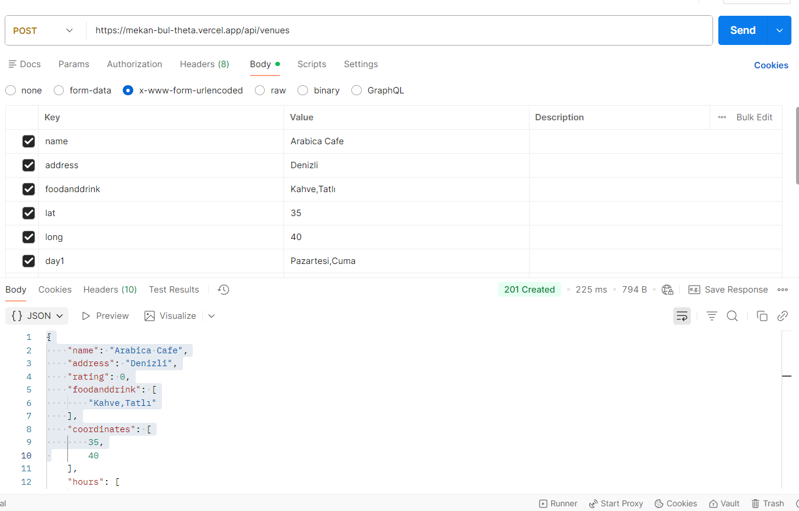
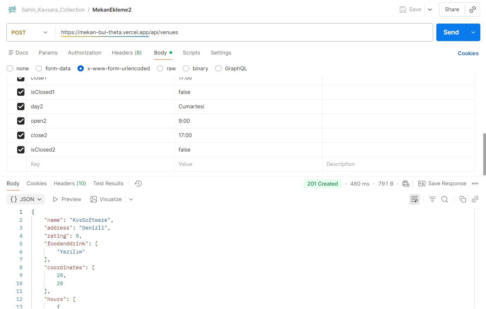

### Mekan Listeleme Test

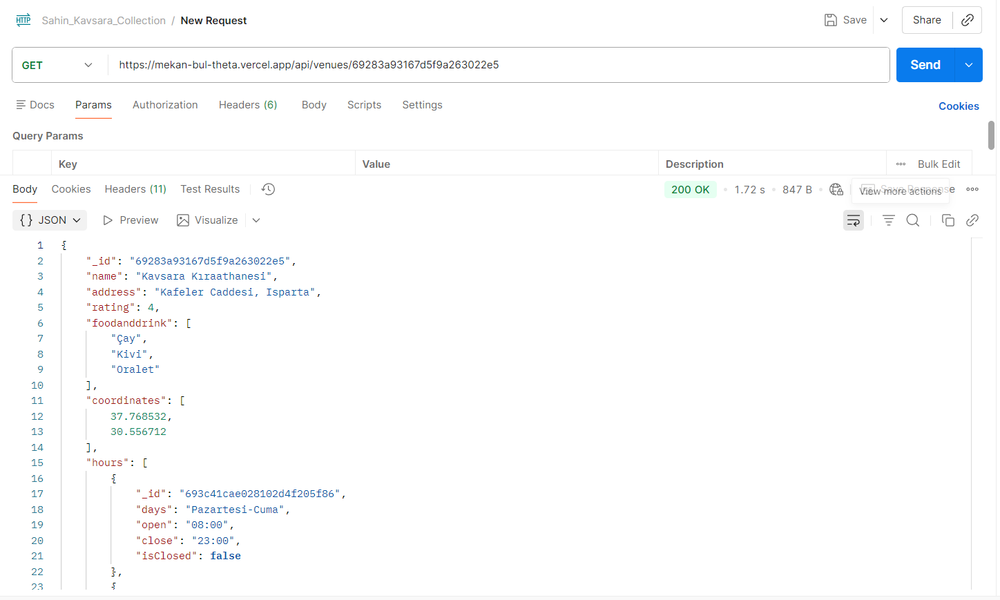

## Mekan Silme Test
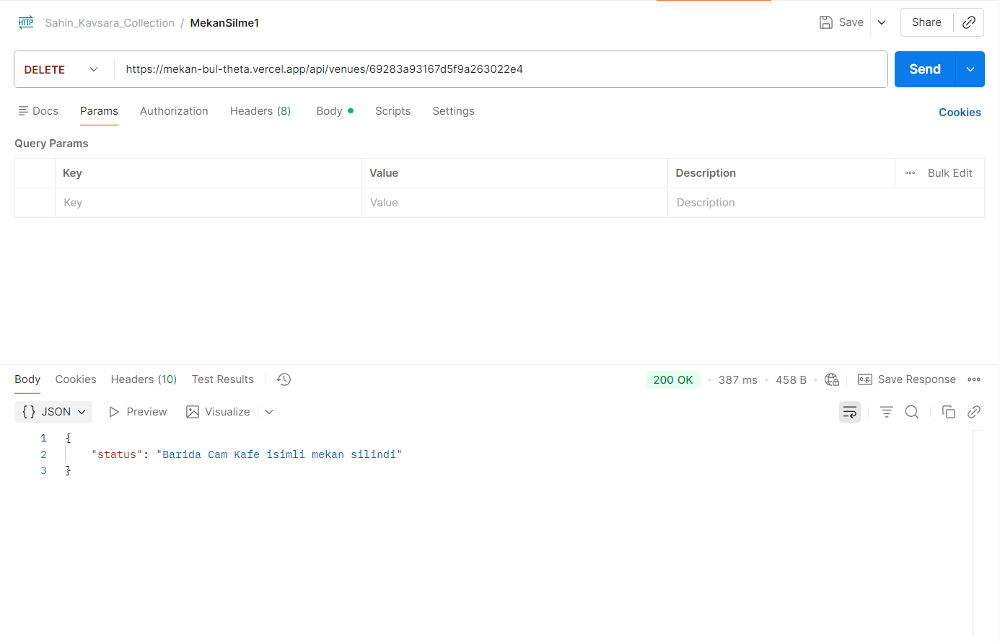

## Mekan Bilgi Güncelleme Test
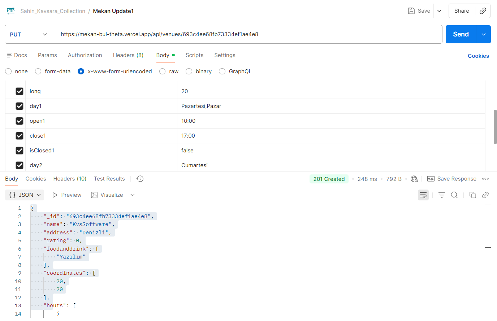

## Yakın Mekanları Listeleme Test
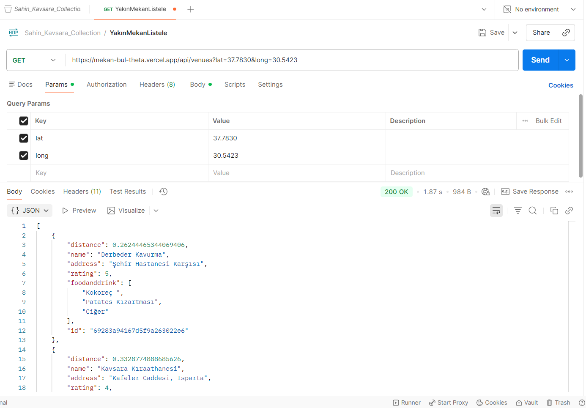

## Yorum Ekleme Test
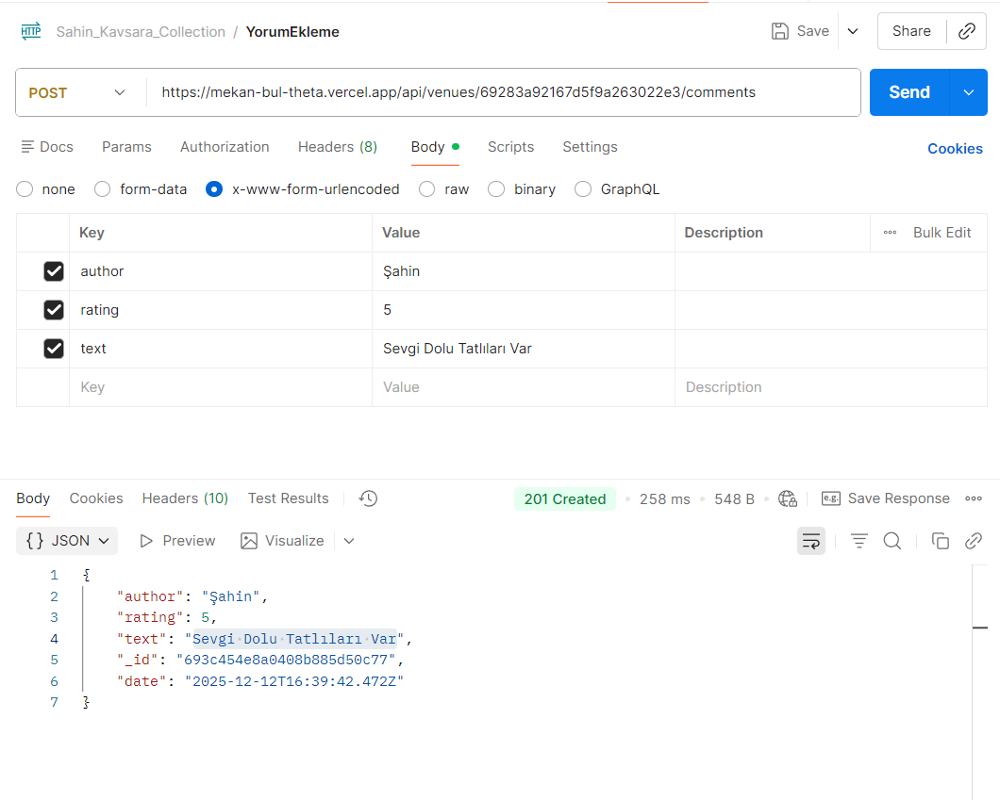
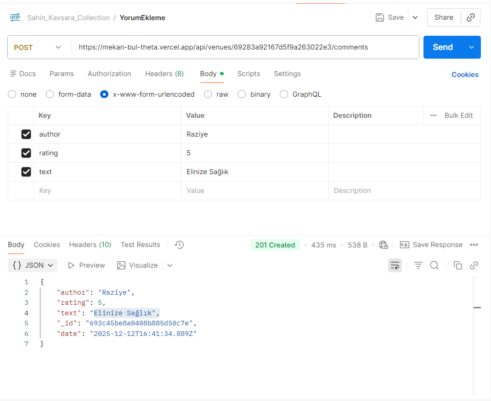

## Yorum Listeleme Test
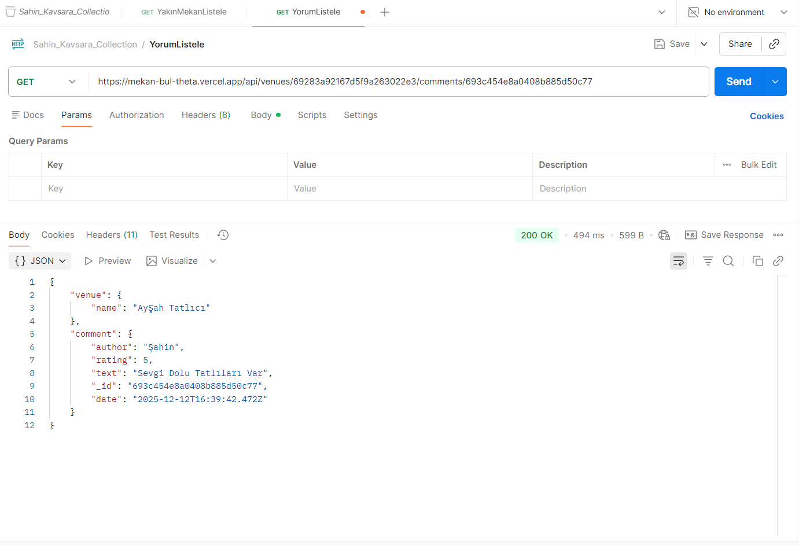

## Yorum Silme Test
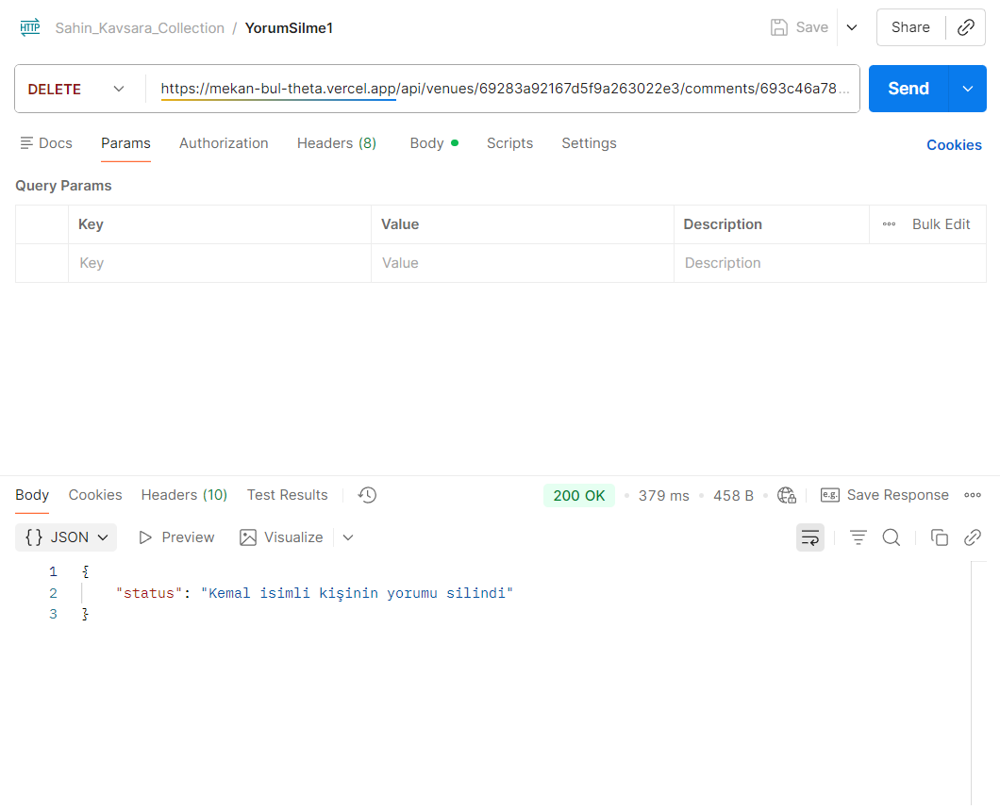
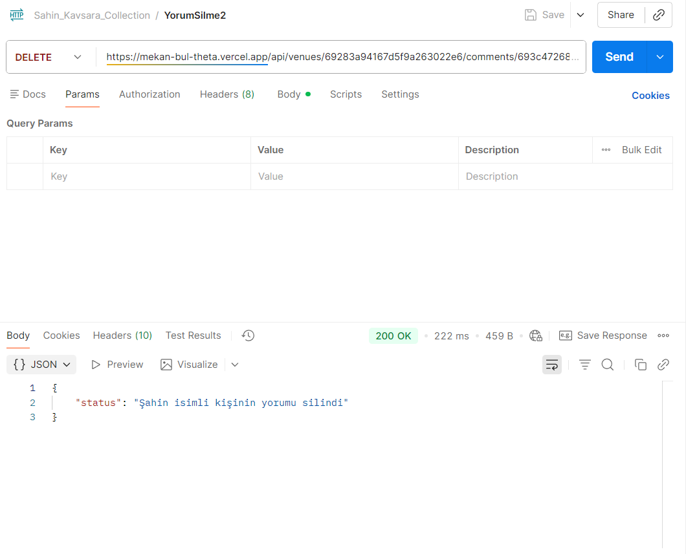

## Yorum Güncelleme Test
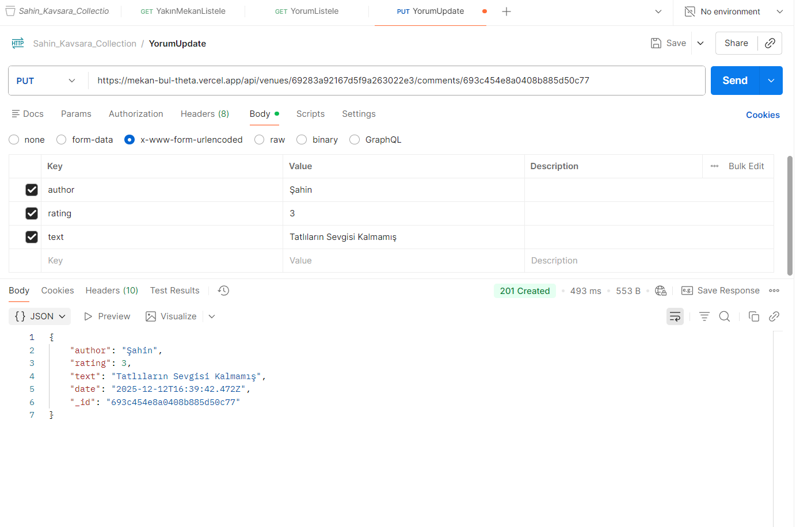